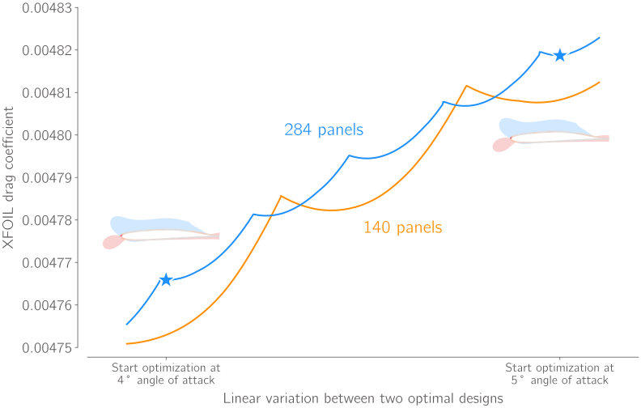

CMPLXFOIL
====================================
CMPLXFOIL is a version of Mark Drela's XFOIL code with the GUI features removed.
Gradient computation is implemented with the complex-step method.
The Python interface is designed to be used with `MACH-Aero <https://mdolab-mach-aero.readthedocs-hosted.com/en/latest/index.html>`_ tools for optimization.
This package also includes some postprocessing tools.

.. toctree::
   :maxdepth: 2

   install
   user-guide
   options
   API
   citation

.. image:: assets/airfoil_opt.gif
   :width: 500
   :align: center

Disclaimer
==========
XFOIL's derivatives are known to be unreliable due to its transition model.
Because this is a result of the numerical simulation approach, using a complex step derivative computation method still faces these problems.

Adler, Gray, and Martins describe this phenomenon in their paper entitled *To CFD or not to CFD? Comparing RANS and viscous panel methods for airfoil shape optimization*.
They observe that these inaccurate derivatives can create local optima.
To visualize the behavior, they evaluate drag along a line in the design space between two optima.
The result is shown below.
Every dip corresponds to the transition location moving across one panel.
Increasing the number of panels helps (CMPLXFOIL uses 284 panels by default), but does not fix the problem.

